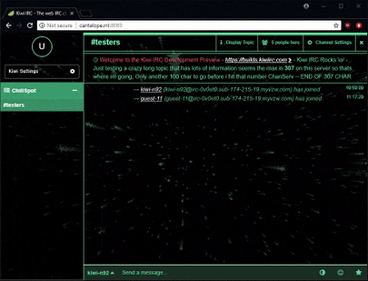

## Starry Plugin for Kiwi IRC

* Scott McGann
* scott@londontrustmedia.com
* https://github.com/srmcgann/plugin-starry

### Description
Starry is a stylish mod for the Kiwi UI.
It renders an animated starfield in Kiwi's background.
The target audience is anyone and everyone who enjoys subtle animations in their app backgrounds.
The smooth, seamless repetition of the flying stars helps people relax while they chat.
